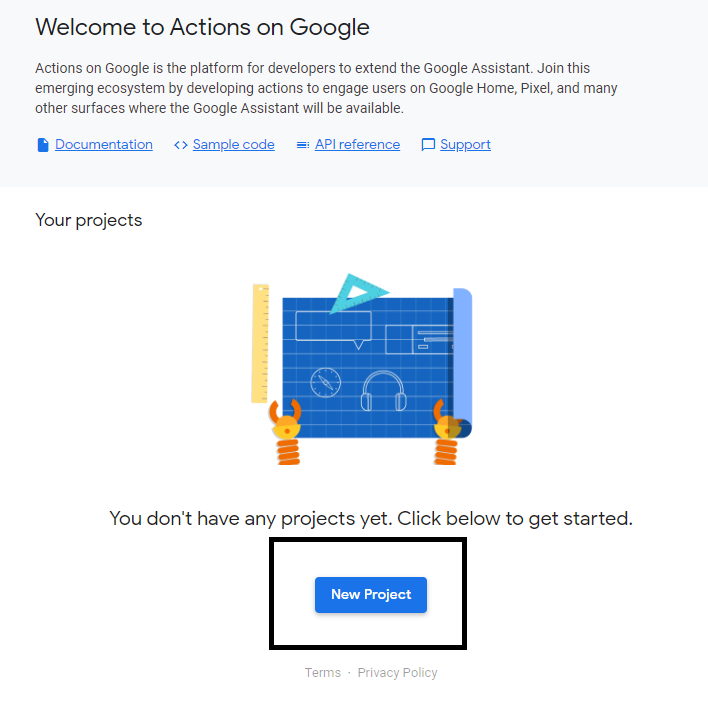
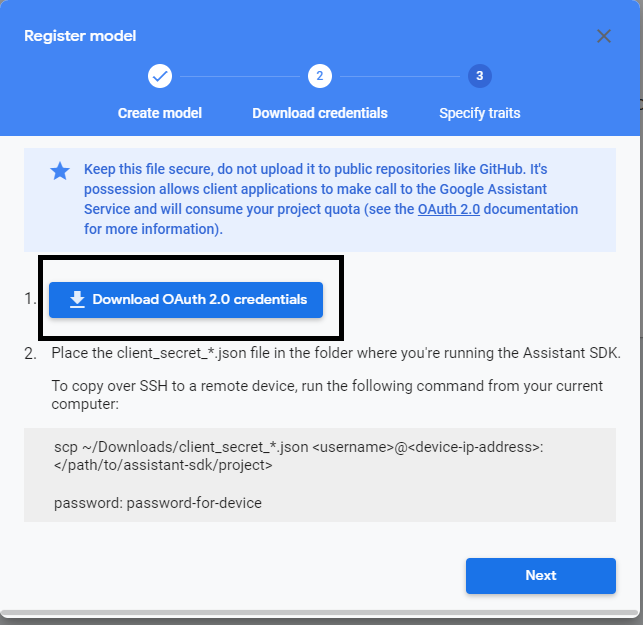
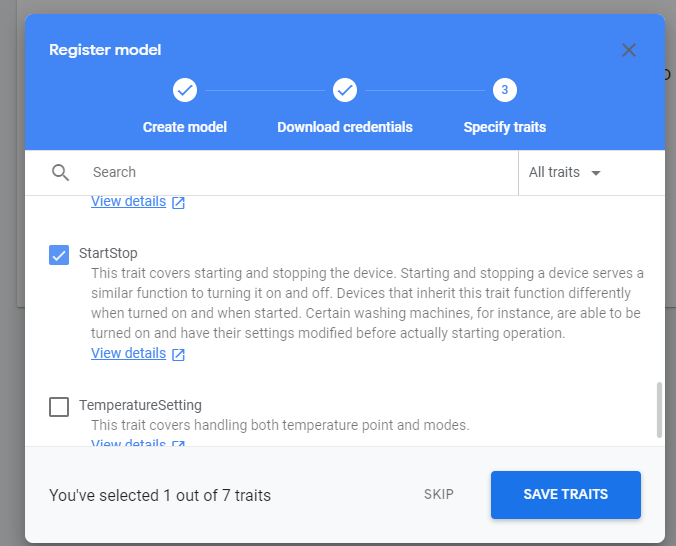
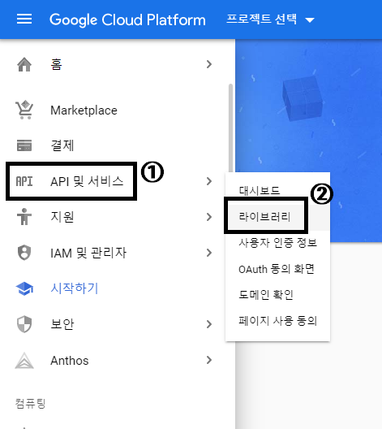
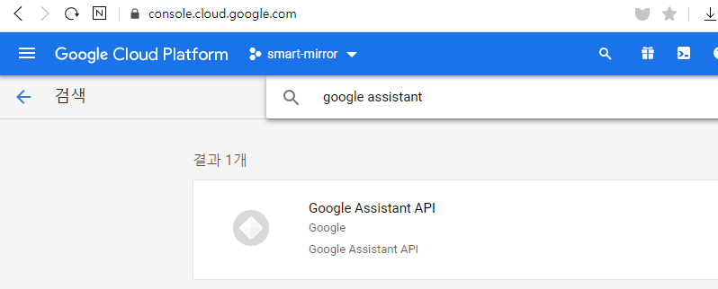

# 마이크와 스피커 설정
- 마이크와 스피커를 라즈베리파이에 연결한다.

1-1. 아래 명령을 사용해 Card number, Device number 를 확인한다.
`aplay -l`로 스피커, `arecord 'l`로 마이크의 번호를 각각 확인한다.

- 파일 매니저를 열고 우클릭해 New File 메뉴를 선택하고 `.asoundrc` 파일을 만든다.

- 파일 매니저의 보기 메뉴에서 숨김 파일 표시를 선택한다.

- `.asoundrc` 파일을 우클릭해 Text Editor 를 사용해 열고 아래 코드를 입력 후 저장한다.
```
pcm.!default {
  type asym
  capture.pcm "mic"
  playback.pcm "speaker"
}
pcm.mic {
  type plug
  slave {
    pcm "hw:마이크카드번호,마이크디바이스번호"
  }
}
pcm.speaker {
  type plug
  slave {
    pcm "hw:스피커카드번호,스피커디바이스번호"
  }
}
```

- `reboot` 명령으로 재시작한다.

- 재부팅 후 터미널을 열어 `speaker-test -t wav` 명령으로 소리가 나는지 확인한다.
소리 크기를 조절하려면 `alsamixer` 명령을 입력한 후 화살표로 소리를 조절 후 `esc` 키를 눌러 완료한다.


# 구글 어시스턴트 사용 설정

- https://console.actions.google.com/ 에 접속한다.

- New Project 버튼을 클릭


- 아래 그림처럼 설정하고 등록 버튼을 누른다.


- 다운로드 후 Next 버튼을 누른다


- StartStop 체크 후 SAVE TRAITS


- https://console.cloud.google.com/ 접속 후 smart-mirror 프로젝트 선택


- 좌측 드로잉 메뉴 클릭 후 API 및 서비스 -> 라이브러리


- google assistant 검색 후 클릭 -> 사용 버튼 클릭


- 좌측 드로잉 메뉴 클릭 후 API 및 서비스 -> OAuth 동의 화면 -> 외부 -> 만들기 -> 이메일 주소 설정 -> 하단에 있는 저장 버튼 클릭

- 아까 다운로드한 파일 이름을 `credentials.json` 으로 변경한다. 나중에 라즈베리파이로 옮겨야 하니 잘 보관한다.
