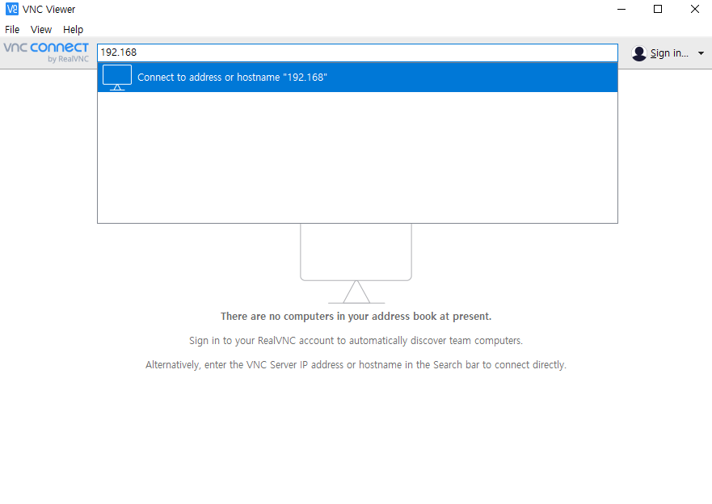
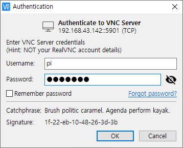

# 라즈베리파이에 운영체제 설치하기
1. Micro SD 카드를 컴퓨터에 연결한다.
2. https://www.raspberrypi.org/downloads/ 에 접속해 Raspberry Pi Imager for Windows 버튼을 클릭해 파일을 다운로드 한 후 실행한다.
3. 설치 후 아래와 같은 프로그램이 실행된다.

4. CHOOSE OS 버튼을 클릭해 Raspberry Pi OS (32-bit) 옵션을 선택한다.
5. CHOOSE SD CARD 버튼을 클릭해 연결된 Micro SD 카드를 선택하고 WRITE 버튼을 눌러 운영체제를 복사한다.
6-1. 5번 과정이 완료되기를 기다리는 동안 https://www.realvnc.com/en/connect/download/viewer/ 에 접속해 VNC Viewer 를 다운로드 후 설치한다.
6-2. https://www.putty.org/ 에 접속해 PuTTY 를 다운로드해 설치한다.
7. 5번 과정이 완료되면 파일 탐색기를 실행해 boot 라는 이름의 디스크에 들어간다.
8. 쉬프트를 누른 상태로 마우스 우클릭을 하고 `여기에 Powershell 창 열기`메뉴를 선택해 Powershell 창을 연다.
9. Powershell 창에 `fsutil file createnew ssh 0` 명령어를 입력해 ssh 라는 빈 파일을 생성한다.
10. `fsutil file createnew wpa_supplicant.conf 0; notepad wpa_supplicant.conf` 명령어를 입력하면 메모장이 열린다. 아래 내용을 입력 후 저장한다.
(TAB) 부분은 키보드의 탭 키를 누른다. `네트워크이름`과 `네트워크비번`을 알맞게 수정해 입력한다.
```
ctrl_interface=DIR=/var/run/wpa_supplicant GROUP=netdev
update_config=1
network={
(TAB)ssid="네트워크이름"
(TAB)psk="네트워크비번"
(TAB)key_mgmt=WPA-PSK
}
```
11. 위 파일을 저장하고 Micro SD 카드를 뽑아 라즈베리파이에 넣고 전원을 킨다.
12. 부팅이 완료되면 나오는 창에서 Next 버튼을 터치 후 Country 를 South Korea 로 바꿔준 후 설정을 완료한다.
13. 라즈베리파이에 USB 키보드를 연결한다.
14. 터미널을 열고 `sudo raspi-config`명령을 입력 후 `5 Interfacing Options` -> `P3 VNC` -> `Yes` 를 선택한다.
15. 키보드의 Tab 키를 눌러 Finish 에 포커스를 맞추고 엔터를 누른다.
16. `reboot`명령을 입력해서 라즈베리파이를 재시작한다. 이제 연결한 USB 키보드를 뺀다. 재시작 후 폰트가 깨질 수 있는데 무시한다.
17. 재부팅 후 화면 우측 상단에 VNC 로고를 터치한다. Connectivity 탭에 IP 주소가 표시된다.
18. VNC Viewer 를 실행해 17번에서 확인한 IP 주소를 아래 사진과 같이 입력하고 엔터를 누른다.

19. Continue 버튼을 클릭해 연결 후 아래 사진처럼 Username: `pi` Password: `raspberry` 를 입력하고 OK를 누른다.

20. 아래 사진에 동그라미 친 부분을 클릭해 터미널을 연다.

21. 아래 명령어를 차례로 입력한다.
`sudo apt update`
`sudo apt upgrade -y`
22. 다음 명령을 입력해 한글 폰트를 설치한다.
`sudo apt-get install fonts-unfonts-core`
23. `reboot` 명령을 입력해 재시작한다.