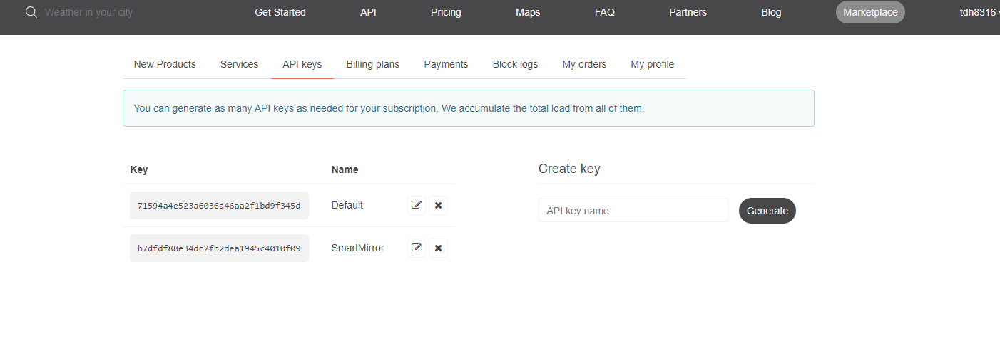

# 매직미러 소프트웨어 설치
터미널을 열고 다음 명령어를 순서대로 입력한다. 
```
curl -sL https://deb.nodesource.com/setup_10.x | sudo -E bash -
sudo apt install nodejs -y
```

1. 다음 명령어를 입력해 매직미러 소스코드를 복제한다.
`git clone https://github.com/MichMich/MagicMirror`

2. 다음 명령을 입력해 매직미러 폴더로 이동한다.
`cd MagicMirror`

3. 다음 명령을 입력해 설치를 시작한다.
`npm install`

4. 다음 명령을 입력해 설정 파일을 만든다.
`cp config/config.js.sample config/config.js`

이제 매직미러 소프트웨어가 설치됐다.
`npm start` 명령으로 바로 실행해볼 수 있지만, 우리는 구글 어시스턴트도 추가할 것이다.


# 구글 어시스턴트 모듈 설치
1. 다음 명령을 실행해 필요한 프로그램을 설치한다.
`sudo apt-get install libmagic-dev libatlas-base-dev sox libsox-fmt-all mpg321 libasound2-dev -y`

2. 다음 명령으로 매직미러 모듈 폴더로 이동한다.
`cd ~/MagicMirror/modules`

3. 다음 명령을 실행해 구글 어시스턴트 모듈을 복제한다.
`git clone https://github.com/bugsounet/MMM-GoogleAssistant`

4. 다음 명령으로 구글 어시스턴트 폴더로 이동한다.
`cd MMM-GoogleAssistant`

5. 다음 명령을 입력해 구글 어시스턴트 모듈을 설치한다.
`npm install`

5-1. Y를 입력해 계속 진행한다.

- USB, Email 내게쓰기 등으로 `credentials.json` 파일을 라즈베리파이의 ~/MagicMirror/modules/MMM-GoogleAssistant 폴더에 넣는다.

- `node auth_and_test.js` 명령을 실행하고 구글 계정으로 로그인한 뒤 모든 권한을 허용하고 인증 코드를 복사해 터미널에 붙여넣는다. (우클릭->붙여넣기)

- Type your request 가 나오면 `hi` 를 입력해보고 구글 어시스턴트가 반응하는지 확인한다. Ctrl+C 키를 눌러 종료한다.

- ~/MagicMirror/config/config.js 파일을 우클릭해 `지니` 옵션을 선택해 파일을 연다.
약 40번째 줄 `modules: [` 밑에 아래 코드를 입력한다.
```javascript
{
  module: "MMM-GoogleAssistant",
  position: "fullscreen_above",
  config: {
    assistantConfig: {
      latitude: 37.7775,
      longitude: 127.8145,
    },
    micConfig: {
      recorder: "arecord",
      device: "plughw:마이크디바이스번호",
    },
  }
},
``` 
더 많은 구성은 https://github.com/bugsounet/MMM-GoogleAssistant/wiki/Configuration-Structure 에서 찾을 수 있다.

- 약 80번째 줄의 `complements` 모듈을 삭제한다.

config.js 파일을 닫지 말고 열어두자..

# 날씨 구성
https://openweathermap.org/ 에 접속해 회원가입을 한다.

API Keys 혹은 My API Keys 메뉴를 선택해 아래 화면으로 이동한다.


약 86번쨰 줄에 `currentweather`, `weatherforecast` 모듈의 `appid` 필드를 API 키로 바꿔준다.
`locationID` 의 내용을 지우고 `location`을 `ChunCheon` 으로 설정한다.

# 뉴스 구성
약 106번째 줄에 `url` 필드를 KBS (http://world.kbs.co.kr/rss/rss_news.htm?lang=k) 로 바꿔준다.

# 스타일 설정
~/MagicMirror/css/main.css 파일을 우클릭해 지니 옵션을 선택해 파일을 연다.

- 12번쨰 줄 `margin`을 `0px`로 바꾼다.

- 14, 15번째 줄 height, width 를 `calc(100%-120px)` 에서 100%로 바꾼다.

# 실행
- `cd ~/MagicMirror` 명령으로 매직미러 폴더로 이동한 뒤 `npm start` 명령을 입력하면 스마트미러 소프트웨어가 실행된다.