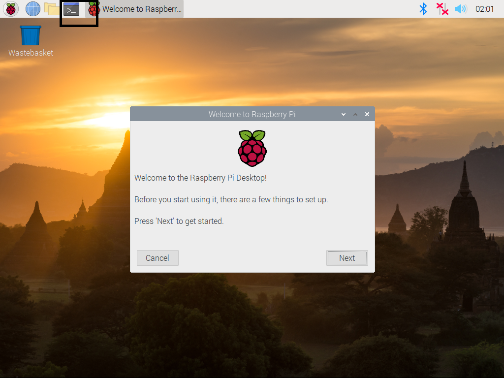
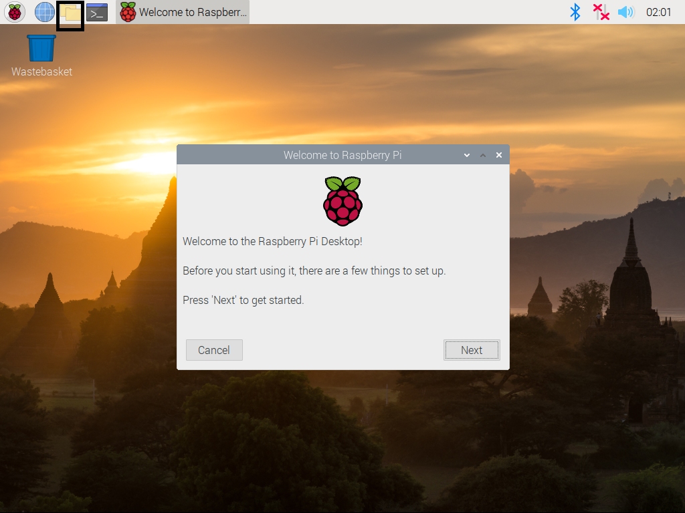

# 라즈베리파이에 운영체제 설치하기
- Micro SD 카드를 컴퓨터에 연결한다.
--------------------
- https://www.raspberrypi.org/downloads/ 에 접속해 Raspberry Pi Imager for Windows 버튼을 클릭해 파일을 다운로드 한 후 실행한다.


--------------------
- 설치 후 아래와 같은 프로그램을 실행한다.


--------------------
- CHOOSE OS 버튼을 클릭해 Raspberry Pi OS (32-bit) 옵션을 선택한다.
- CHOOSE SD CARD 버튼을 클릭해 연결된 Micro SD 카드를 선택하고 WRITE 버튼을 눌러 운영체제를 복사한다.
- 앞의 과정이 완료되기를 기다리는 동안 https://www.realvnc.com/en/connect/download/viewer/ 에 접속해 VNC Viewer 를 다운로드 후 설치한다.
--------------------
- WRITE 과정이 완료되면 파일 탐색기를 실행해 boot 라는 이름의 디스크에 들어간다.
- 쉬프트를 누른 상태로 마우스 우클릭을 하고 `여기에 Powershell 창 열기`메뉴를 선택해 Powershell 창을 연다.
- Powershell 창에 `fsutil file createnew ssh 0` 명령어를 입력해 ssh 라는 빈 파일을 생성한다.
- `fsutil file createnew wpa_supplicant.conf 0; notepad wpa_supplicant.conf` 명령어를 입력하면 메모장이 열린다. 아래 내용을 입력 후 저장한다.
(TAB) 부분은 키보드의 탭 키를 누른다. `네트워크이름`과 `네트워크비번`을 알맞게 수정해 입력한다.
```
ctrl_interface=DIR=/var/run/wpa_supplicant GROUP=netdev
update_config=1
network={
(TAB)ssid="네트워크이름"
(TAB)psk="네트워크비번"
(TAB)key_mgmt=WPA-PSK
}
```
---------------------
- 위 파일을 저장하고 Micro SD 카드를 뽑아 라즈베리파이에 넣고 전원을 킨다.
- 부팅이 완료되면 나오는 창에서 Next 버튼을 터치 후 Country 를 South Korea 로 바꿔준 후 설정을 완료한다.
---------------------
- 라즈베리파이에 USB 키보드를 연결한다.
- 라즈베리파이에서 터미널을 열고 `sudo raspi-config`명령을 입력 후 `5 Interfacing Options` -> `P3 VNC` -> `Yes` 를 선택한다.
- 키보드의 Tab 키를 눌러 Finish 에 포커스를 맞추고 엔터를 누른다.
- `reboot`명령을 입력해서 라즈베리파이를 재시작한다. 이제 연결한 USB 키보드를 뺀다. 재시작 후 폰트가 깨질 수 있는데 무시한다.
- 재부팅 후 라즈베이파이 화면 우측 상단에 VNC 로고를 터치한다. Connectivity 탭에 IP 주소가 표시된다.
---------------------
- PC 에서 VNC Viewer 를 실행해 위에서 확인한 IP 주소를 아래 사진과 같이 입력하고 엔터를 누른다.

- Continue 버튼을 클릭해 연결 후 아래 사진처럼 Username: `pi` Password: `raspberry` 를 입력하고 OK를 누른다.


이제 PC에서 라즈베리파이를 조작할 수 있다.

----------------------
- 라즈베리파이에서 아래 사진에 동그라미 친 부분을 클릭해 터미널을 연다.

----------------------
- 터미널에서 아래 명령어를 차례로 입력한다.
    1. `sudo apt update`
    2. `sudo apt upgrade -y`
- 터미널에서 다음 명령을 입력해 한글 폰트를 설치한다.
`sudo apt-get install fonts-unfonts-core`

- 터미널에서 `reboot` 명령을 입력해 재시작한다.

# 매직미러 소프트웨어 설치
터미널을 열고 다음 명령어를 순서대로 입력한다. 

1. `curl -sL https://deb.nodesource.com/setup_10.x | sudo -E bash -`
2. `sudo apt install nodejs -y`


- 터미널에서 다음 명령어를 입력해 매직미러 소스코드를 복제한다.
`git clone https://github.com/MichMich/MagicMirror`

- 터미널에서 다음 명령을 입력해 매직미러 폴더로 이동한다.
`cd MagicMirror`

- 터미널에서 다음 명령을 입력해 설치를 시작한다.
`npm install`

- 터미널에서 다음 명령을 입력해 설정 파일을 만든다.
`cp config/config.js.sample config/config.js`

이제 매직미러 소프트웨어가 설치됐다.
`npm start` 명령으로 바로 실행해볼 수 있지만, 우리는 구글 어시스턴트도 추가할 것이다.

# 마이크와 스피커 설정
- 마이크와 스피커를 라즈베리파이에 연결한다.

- 아래 명령을 사용해 Card number, Device number 를 확인한다.
`aplay -l` 명령으로 스피커, `arecord -l` 명령으로 마이크의 Card number, Device number 를 각각 확인한다.


------------------


- 파일 매니저를 열고 우클릭해 New File 메뉴를 선택하고 `.asoundrc` 파일을 만든다.

- 파일 매니저의 보기 메뉴에서 숨김 파일 표시 항목을 선택한다.

- `.asoundrc` 파일을 우클릭해 Text Editor 를 사용해 열고 아래 코드를 입력 후 저장한다.
```
pcm.!default {
  type asym
  capture.pcm "mic"
  playback.pcm "speaker"
}
pcm.mic {
  type plug
  slave {
    pcm "hw:마이크카드번호,마이크디바이스번호"
  }
}
pcm.speaker {
  type plug
  slave {
    pcm "hw:스피커카드번호,스피커디바이스번호"
  }
}
```

- 파일을 저장한 후 터미널에서 `reboot` 명령을 입력해 라즈베리 파이를 재시작한다.

- 재부팅 후 터미널을 열어 `speaker-test -t wav` 명령으로 소리가 나는지 확인한다.
소리 크기를 조절하려면 `alsamixer` 명령을 입력한 후 키보드의 화살표로 소리를 조절 후 `esc` 키를 눌러 완료한다.


# 구글 어시스턴트 구성

- https://console.actions.google.com/ 에 접속한다.
- New Project 버튼을 클릭


- 프로젝트 이름을 설정한다. 아래 그림과 같이 언어와 지역을 설정한다.


- 프로젝트 만들기 버튼을 누르면 아래 화면으로 넘어간다. 여기서 아래와 같이 Device registration 버튼을 누른다.


- REGISTER MODEL 버튼을 누르면 나오는 팝업에서 아래 그림처럼 설정하고 REGISTER MODEL 버튼을 누른다.


- OAuth 증명 파일을 다운로드 후 Next 버튼을 누른다. 다운로드한 파일 이름을 `credentials.json` 으로 변경한다. 나중에 라즈베리파이로 옮겨야 하니 잘 보관한다.


- StartStop 체크 후 SAVE TRAITS


- https://console.cloud.google.com/ 에 접속한 후 Google Cloud Platform 오른쪽 메뉴에서 smart-mirror 프로젝트를 선택한다.


- 좌측 드로잉 메뉴 클릭 후 API 및 서비스 -> 라이브러리


- google assistant 검색 후 클릭 -> 사용 버튼 클릭


- 좌측 드로잉 메뉴 클릭 후 API 및 서비스 -> OAuth 동의 화면 -> 외부 -> 만들기 -> 이메일 주소 설정 -> 하단에 있는 저장 버튼 클릭

# 구글 어시스턴트 모듈 설치
- 터미널에서 다음 명령을 실행해 필요한 프로그램을 설치한다.

    `sudo apt-get install libmagic-dev libatlas-base-dev sox libsox-fmt-all mpg321 libasound2-dev -y`

- 터미널에서 다음 명령으로 매직미러 모듈 폴더로 이동한다.

    `cd ~/MagicMirror/modules`

- 터미널에서 다음 명령을 실행해 구글 어시스턴트 모듈을 복제한다.
`git clone https://github.com/bugsounet/MMM-GoogleAssistant`

- USB, Email 내게쓰기 등으로 `credentials.json` 파일을 라즈베리파이의 ~/MagicMirror/modules/MMM-GoogleAssistant 폴더에 넣는다.

- 터미널에서 다음 명령으로 구글 어시스턴트 폴더로 이동한다.

    `cd ~/MagicMirror/modules/MMM-GoogleAssistant`

- 터미널에서 다음 명령을 입력해 구글 어시스턴트 모듈을 설치한다.
`npm install`
  - 설치 중 확인을 물을 경우 Y를 입력해 계속 진행한다.
  

# 구글 어시스턴트 모듈 변경사항
**구글 어시스턴트 모듈이 금지되면서 정상적인 방법으로는 사용이 불가능해졌다. 이거대로만 따라하면 쓸 수 있다 그러니까 따라해라**
- `~/MagicMirror/modules/MMM-GoogleAssistant` 경로로 이동한다.
- `package.json` 파일을 연다.
- 3번째 줄 `version`을 2.4.11에서 2.4.10 으로 바꾼다.
- 30번째 줄 `MD5` 값을 `!!no-authorization!!` 을 지우고 `863b40e588d9ab346cae9f854c7e44a2` 로 바꾼다.

- `~/MagicMirror/modules/MMM-GoogleAssistant/node_modules/@bugsounet/md5/index.js` 파일을 연다.
- 원래 있던 코드를 모두 지우고 아래 코드를 입력한다.
```javascript
const md5 = require("md5"),
    fs = require("fs");
var Module_MD5 = require("../../../package.json").MD5,
    Module_Name = require("../../../package.json").name,
    Module_Files = [];
class MD5 {
    constructor(s, e = (() => {})) {
        if (this.GA = ["modules/MMM-GoogleAssistant/node_helper.js", "modules/MMM-GoogleAssistant/MMM-GoogleAssistant.js", "modules/MMM-GoogleAssistant/components/actionManager.js", "modules/MMM-GoogleAssistant/components/assistant.js", "modules/MMM-GoogleAssistant/components/response.js", "modules/MMM-GoogleAssistant/components/screenParser.js"], this.A2D = ["modules/MMM-Assistant2Display/node_helper.js", "modules/MMM-Assistant2Display/MMM-Assistant2Display.js", "modules/MMM-Assistant2Display/components/display.js", "modules/MMM-Assistant2Display/components/spotify.js", "modules/MMM-Assistant2Display/components/youtube.js"], this.config = s, this.default = {
                debug: !1
            }, this.cb = e, this.config = Object.assign(this.default, this.config), "MMM-GoogleAssistant" == Module_Name) Module_Files = this.GA;
        else {
            if ("MMM-Assistant2Display" != Module_Name) return console.log("[MD5] Really MD5 needed ?"), process.abort();
            Module_Files = this.A2D
        }
        this.start()
    }
    async start() {
        if (this.config.dev && this.config.debug || this.config.force) return console.log("[MD5] Bypassed..."), void(this.config.dev ? this.make() : this.config.force && this.cb());
        if (!Module_MD5) return console.log("[MD5] No Module MD5 found!"), process.abort();
        if (Module_Files && Object.keys(Module_Files).length > 0) {
            var s = [];
            for (let [e, o] of Object.entries(Module_Files)) s[e] = await this.get_MD5(o);
            return  this.cb()
        }
        return console.log("[MD5] No files to scan!"), process.abort()
    }
    async make() {
        var s = [];
        if (Module_Files) {
            for (let [e, o] of Object.entries(Module_Files)) s[e] = await this.get_MD5(o);
            var e = md5(s.toString().replace(",", ""));
            console.log("[MD5] " + Module_Name + " MD5 Value:", e)
        } else console.log("[MD5] Wow ! there is no files to scan!");
        this.cb()
    }
    get_MD5(s) {
        return new Promise(e => {
            fs.readFile(s, (s, o) => {
                if (s) return console.log("[MD5] ERROR", s), process.abort();
                var t = md5(o);
                e(t)
            })
        })
    }
}
module.exports = MD5;
```


> 여기까지 변경된 부분. 이후 내용은 같음.

-----------------------------------

- 터미널에서 `node auth_and_test.js` 명령을 실행하고 구글 계정으로 로그인한 뒤 모두 동의하고 인증 코드를 복사해 터미널에 붙여넣는다. (우클릭->붙여넣기)

- 터미널에서 `Type your request` 가 나오면 `hi` 를 입력해보고 구글 어시스턴트가 반응하는지 확인한다. Ctrl+C 키를 눌러 종료한다.

- `geany ~/MagicMirror/config/config.js` 명령으로 구성 파일을 연다.
약 40번째 줄 `modules: [` 밑에 아래 코드를 입력한다.
```javascript
{
  module: "MMM-GoogleAssistant",
  position: "fullscreen_above",
  config: {
    assistantConfig: {
      latitude: 37.7775,
      longitude: 127.8145,
    },
    micConfig: {
      recorder: "arecord",
      device: "plughw:마이크디바이스번호",
    },
  }
},
``` 
마이크디바이스번호는 앞에서 `arecord -l` 명령으로 확인했던 숫자를 입력한다.
더 많은 옵션은 https://github.com/bugsounet/MMM-GoogleAssistant/wiki/Configuration-Structure 에서 찾을 수 있다.

약 80번째 줄의 `complements` 모듈을 삭제한다.

`config.js` 파일을 닫지 말고 열어두자..

# 날씨 구성
https://openweathermap.org/ 에 접속해 회원가입을 한다.

API Keys 혹은 My API Keys 메뉴를 선택해 아래 화면으로 이동한다.


- 약 86번쨰 줄에 `currentweather`, `weatherforecast` 모듈의 `appid` 필드를 위에서 확인한 키로 바꿔준다.
- `locationID` 의 내용을 지우고 `location`을 `ChunCheon` 으로 설정한다.

# 뉴스 구성
약 106번째 줄에 `url` 필드를 `http://world.kbs.co.kr/rss/rss_news.htm?lang=k` 로 바꿔준다.

# 스타일 설정
터미널에서 `geany ~/MagicMirror/css/main.css` 명령을 실행해 스타일시트 파일을 연다.

- 12번쨰 줄 `margin`의 값을 `0px`로 바꾼다.

- 14, 15번째 줄 height, width 의 값을 `calc(100%-120px)` 에서 `100%`로 바꾼다.

# 실행
- 터미널에서 `cd ~/MagicMirror` 명령으로 매직미러 폴더로 이동한 뒤 `npm start` 명령을 입력하면 스마트미러 소프트웨어가 실행된다.

# 부팅 후 자동으로 실행
- 터미널에서 다음 명령을 순서대로 입력한다.
1. `sudo npm install -g pm2`
2. `pm2 startup`

- home 경로에 `mm.sh` 파일을 만든다.
- 아래 코드를 입력하고 저장한다.
```
cd ./MagicMirror
DISPLAY=:0 npm start
```
- 터미널에서 다음 명령을 입력한다: `chmod +x mm.sh`

- 터미널에서 다음 명령을 입력해 스마트미러를 실행한다: `pm2 start mm.sh`
- 키보드의 `Alt+Tab` 키를 눌러 터미널 창으로 전환하고 `pm2 save` 명령을 입력한다.